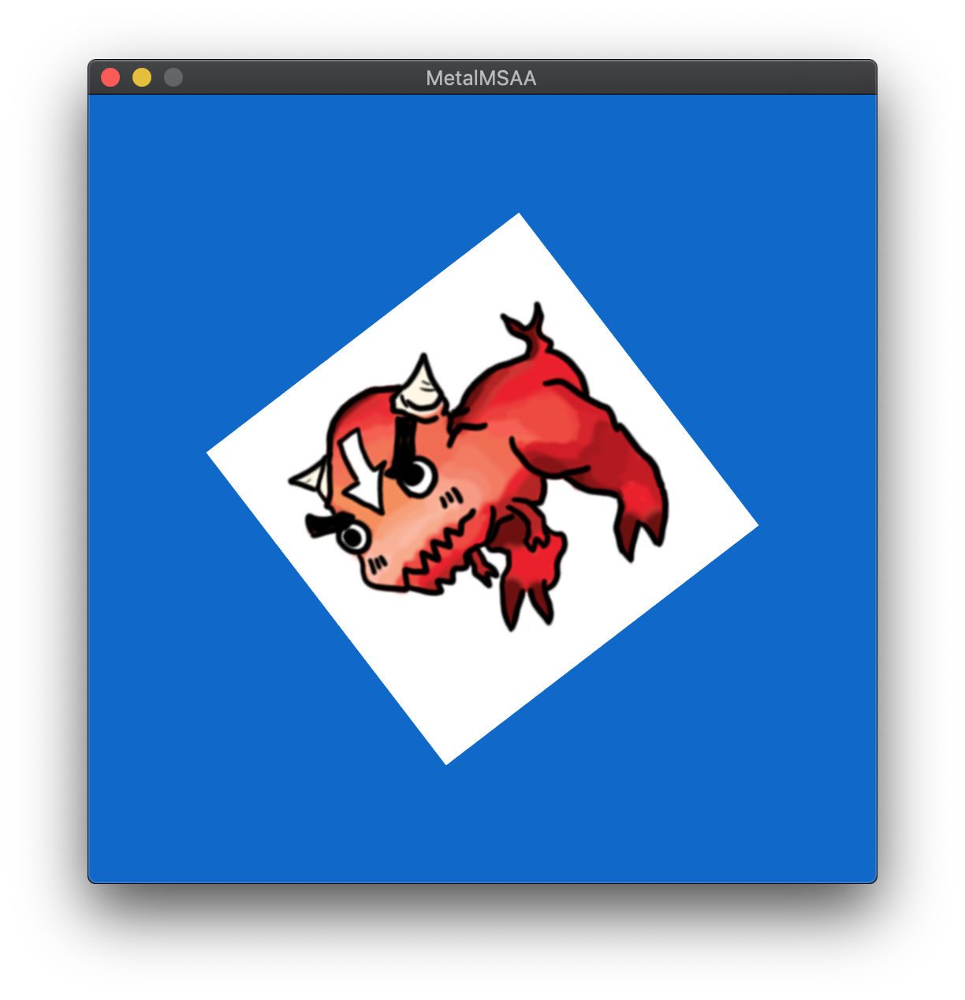

# MetalGraphicsPlayground

This workspace contains subprojects for testing Metal features.
Requires Xcode 11 or later.

## Rendering Engine (work in progress)

**MetalDeferred**, **MetalPostProcessing** and **MetalSceneGraph** use deferred rendering based PBR frameworks.
You can check framework sources codes in **Common** directory!

**Features**
* Deferred Rendering
  * Light pre-pass based
    * G-buffer pass : Albedo, Normal, Tangent, Shading, Depth
    * Light pass : Light + Shadow Accumulation
    * Shade pass : Convolution
  * Tile deferred
    * G-buffer pass : Albedo, Normal, Tangent, Shading, Depth
    * Light culling pass
    * Shade pass : Convolution
* Image based Lighting
  * HDRI Image (Equirectangular map -> Cubemap)
  * Split-sum approximation model
* Physically based Rendering
  * Metalic, Roughness, Anisotropic
* Light
  * Directional Light
  * Point Light
  * Shadow (Bilinear, PCF)
  * Light Culling (Tile-based)
* Post-processing
  * Screen-Space Ambient Occlusion
  * Screen-Space Reflection
* Frustum Culling
  * Sphere
* Scene Graph
  * Scene, Node, Component

**Render Pass**

**Showcase Videos** (Click to watch)

Samples (Legacy)

## MetalTextureLOD

* Texture data updating and textureLOD in shader.

## MetalModels

* ModelIO Test

## MetalMSAA

* MSAA resolve

## MetalGeometry

## MetalShadowMapping

* Shadow mapping

## MetalIZBShadow

* Just another shadow mapping test. NOT Irregular z-buffer :=(

## MetalEnvironmentMapping

* PBR (Physically based rendering) (referenced UE4 shader docs)
  * Image based lighting (+ Environment mapping)
  * Prefilterd Irradiance Map
  * Metalic and roughness
  
## MetalInstancing

* Instancing

## MetalDeferred

* Deferred Rendering
* Instancing
* PBR Lighting and Image based Lighting
* Referenced [LearnOpenGL](https://learnopengl.com/PBR/Theory)
* HDR Images from [sIBL Archive](http://www.hdrlabs.com/sibl/archive.html), which is licensed under [CC BY-NC-SA 3.0](http://creativecommons.org/licenses/by-nc-sa/3.0/us/)

## MetalPostProcessing

* Under construction!
* Shadow-mapping (PCF)
* Screen-Space Ambient Occlusion
* Screen-Space Reflection
* Frustum Culling (Sphere)
* Light Culling (Tile-based)
* Gizmos
* TODO
  * Color grading (Tone mapping)
  * Depth of Field
  * Axis-Aligned Bounding Box

  ## MetalSceneGraph

  

  * Scene Graph (Scene, Node, Component)
  * General-purpose renderer
