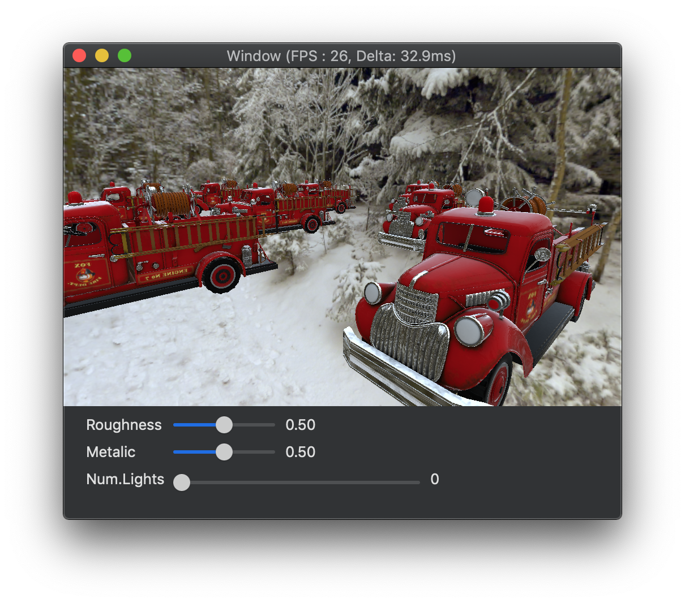

# MetalGraphicsPlayground

This workspace contains subprojects for testing Metal features.
Requires Xcode 9 or later.

## MetalTextureLOD

* Texture data updating and textureLOD in shader.

## MetalModels

* ModelIO Test

## MetalMSAA

* MSAA resolve

## MetalGeometry

## MetalShadowMapping

* Shadow mapping

## MetalIZBShadow

* Just another shadow mapping test. NOT Irregular z-buffer :=(

## MetalEnvironmentMapping

* PBR (Physically based rendering) (referenced UE4 shader docs)
  * Image based lighting (+ Environment mapping)
  * Prefilterd Irradiance Map
  * Metalic and roughness
  
## MetalInstancing

* Instancing

## MetalDeferred (under construction)

* Deferred Rendering
* Instancing
* PBR Lighting (under construction)
